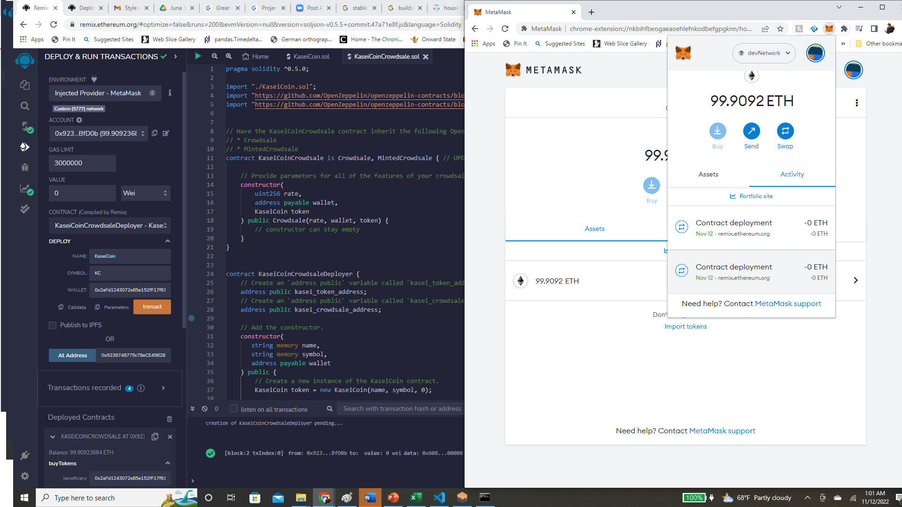

# Challenge21

This is a program builds a smart contract on the Ethereum Blockchain in the form of crowd sourcing for a customized token.

---

## Technologies

This project leverages solidity (pragma ^0.5.0).

---

## Installation Guide

No installation required.  Can be run on Remix IDE.
---

## Usage

This application runs on the Remix IDE.  The application can be manipulated by interacting with the interface buttons.

## Contributors

Brought to you by Russell Moore & Columbia Fintech Bootcamp.

---
## License

Open Source

## Version

First Version and only version as everything ran smoothly.

## Evaluation Report

 Here are example transactions from the smart contract:

